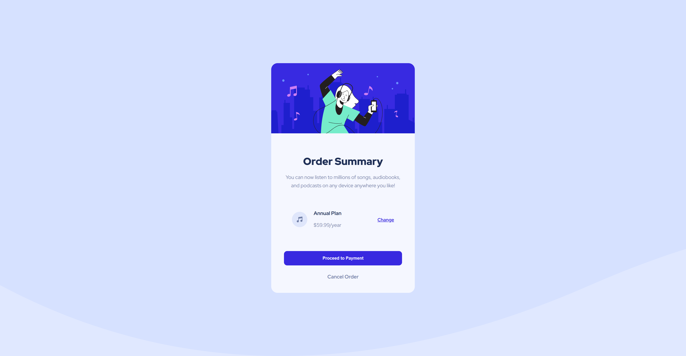
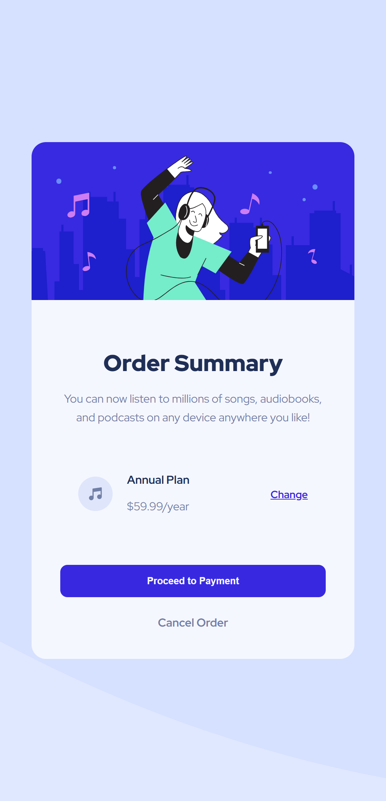

# Frontend Mentor - Order summary card solution

This is a solution to the [Order summary card challenge on Frontend Mentor](https://www.frontendmentor.io/challenges/order-summary-component-QlPmajDUj). Frontend Mentor challenges help you improve your coding skills by building realistic projects. 

## Table of contents

- [Overview](#overview)
  - [The challenge](#the-challenge)
  - [Screenshots](#screenshots)
  - [Links](#links)
- [My process](#my-process)
  - [Built with](#built-with)
  - [What I learned](#what-i-learned)
  - [Continued development](#continued-development)
- [Author](#author)
- [Acknowledgments](#acknowledgments)

**Note: Delete this note and update the table of contents based on what sections you keep.**

## Overview

### The challenge

Users should be able to:

- See hover states for interactive elements

### Screenshots

### Links

- Solution URL: <a href="https://https://www.frontendmentor.io/solutions/order-summary-card-Y7cvtYPP6C/" target="_blank" rel="noreferrer"> Solution </a>
- Live Site URL: <a href="https://https://order-summary-carrd.netlify.app//" target="_blank" rel="noreferrer">Live Site </a>

## My process

### Built with

- Semantic HTML5 markup
- CSS custom properties
- Flexbox

### What I learned

- How to center a component on the page without using absolute positioning

- Building layouts using Flexbox inside the card instead of body/grid

- Creating smooth hover/focus states for buttons and links

### Continued development

- Practicing more responsive layouts  
- Exploring CSS Grid  
- Enhancing accessibility in future projects  

## Author

- Frontend Mentor - <a href="https://www.frontendmentor.io/profile/poseidon0211-hub" target="_blank" rel="noreferrer">@poseidon0211-hub</a>

## Acknowledgments

- I am deeply grateful to Mr. Albert for his dedicated support and encouragement throughout my learning journey in HTML and CSS. His clear explanations and practical advice were especially helpful in completing the Product Component project. His mentorship made a significant impact on my understanding and confidence in front-end development.
